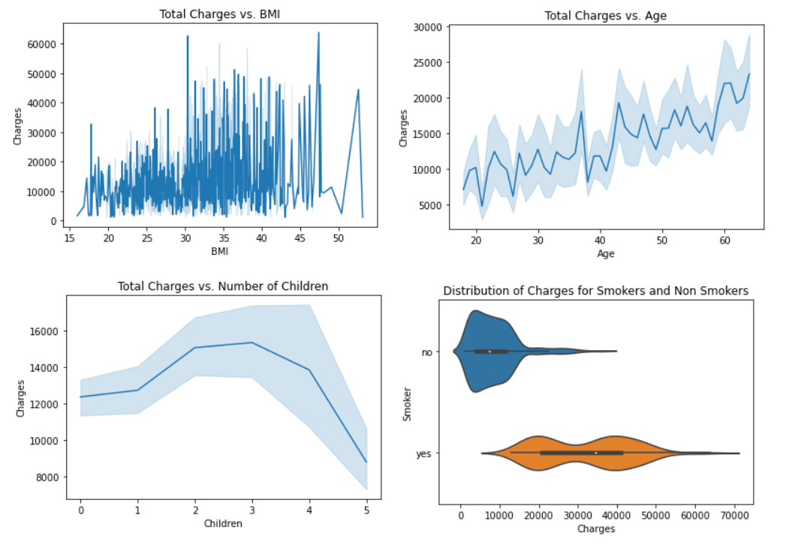

# EDA and Analysis

### *Note: All code can be found in AnalysisNotebook.ipynb

## EDA

First by using '.describe' and '.describe(exclude[np.number])' on the wrangled dataset I got general information on the data, such as:

- Total Entries: 1338
- Max/Min Age = 18/64
- Max/Min BMI = 53.13/15.96
- Max/Min Children = 0/5
- Max/Min Charges = 1121.87/63770.43
-  Average BMI is relatively low (30.66)
- Average Children is low (1.09)

By using .values_count() on the Smoker column I found that 1064 were not smokers while 274 were smokers

Next I wanted to see how the attributes Age, Children, BMI and Smoker relate to changes in Charges, so for the quantitative attributes I used a lineplot and for the qualitative Smoker attribute I just put the Smoker's and NonSmoker's charges on a violin plot.

These plots show that BMI has little correlation with Charges, although does slightly follow an x/y slope. Age increases Charges at a reasonable and expected rate. Interestingly Number of Children actually forms a parabola, where charges decrease on average after three children, but the variation of amounts also means it is not a deciding factor. Finally Smoking shows an expected but still prominent correlation between higher charges and smoking, which is our focus of this analysis.

## Analysis

